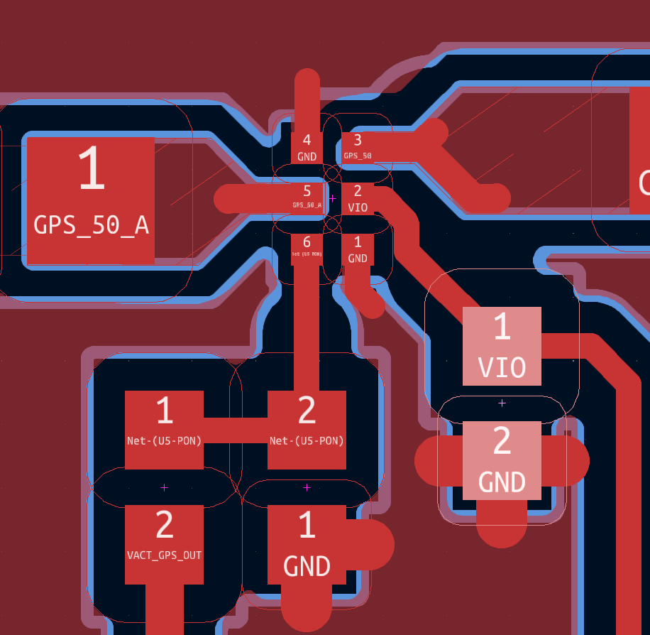
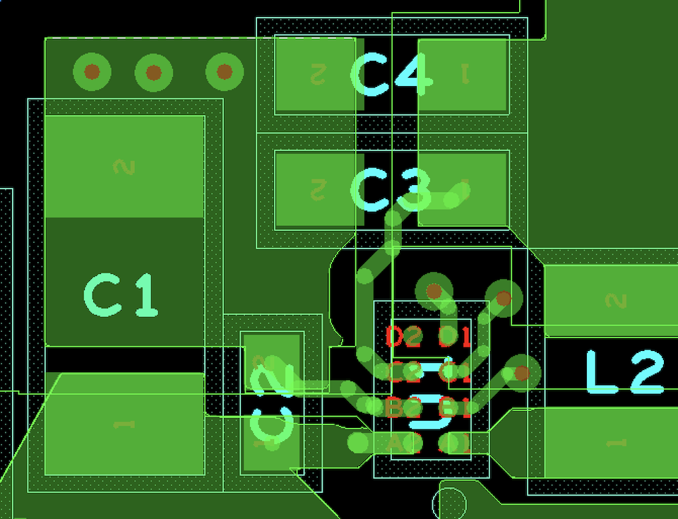
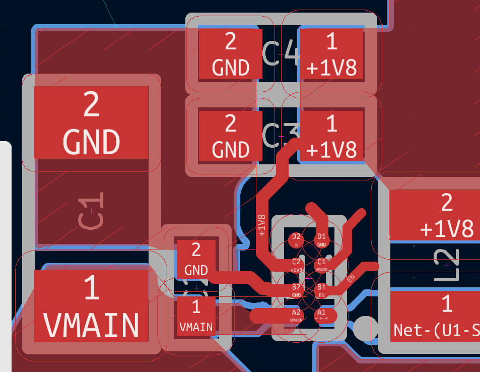

# Porting Notes

As per [Notecarrier-B](../../../Notecarrier-B/KiCad_format/documentation/PortingNotes.md), except:

## Project

The complexity falls neatly between Notecarrier-B (single sheet) and Notecarrier-F (multiple sheets, which I upconverted to be hierarchial). At two sheets, introducing hierarchy is unnecessary. Nonetheless, KiCad still leans towards having a "root" (top-level) sheet that references other sheets in the project. This works out nicely, providing an opportunity to port the mechanical components on the original "revision" sheet, which then acts as a "table of contents", maintaining the name and ordering of the two main schematic sheets. We can then take advantage of the "flat" project style described in the [KiCad docs](https://docs.kicad.org/7.0/en/eeschema/eeschema.html):

> Flat: a sub-case of a simple hierarchy, without connections between subsheets and their parent. Flat hierarchies can be used to represent a non-hierarchical design.


## Schematic

- Some of the symbols convey useful information, so have been ported.
	- Eg. `3xAA`, `B2B-PH-SM4-TBT(LF)(SN)`.
	- The USB micro and B symbols are good too, but for now I will stick with the convention in Notecarrier-B to avoid creating a new one.
		- This has the side-effect of losing the subtle visual indication that one is vertical and one is horizontal, but is in keeping with the convention that schematic symbols don't include this sort of detail.
- KiCad only supports two orientations of schematic text, so I've flipped `L7` and `L8` 180°.

### BOM

- Extracting the necessary information from the existing design files was cumbersome, so a specific BOM was generated:
	- Tools --> Bill Of Materials.
	- Check "Process entire design" and "Use instances".
	- Set "Header" to: `Reference\tValue\tCaratteristiche\tDescription\tMPN\tNote\tPkg Type\tDistributor\tTemp Range\tColor\tDatabase\tDesignator`.
	- Set "Combined property string:" to: `{Reference}\t{Value}\t{Caratteristiche}\t{Description}\t{MPN}\t{Note}\t{Pkg Type}\t{Distributor}\t{Temp Range}\t{Color}\t{Database}\t{Designator}`
	- Unselect "Place each part entry on a separate line.
	- Click "OK".
	- Open output file in a spreadsheet viewer and then compare to and copy-paste between KiCad's "Symbol Field Table".
- Again, some of the original text is Italian and I've not undertaken a translation. However, some of the parts match parts in Notecarrier-B or -F which have already been translated (eg. screw, diode, fuse, micro-usb connector and ICs). So where there's no chance of introducing falsehoods, I've integrated the existing translations.
	- Over time I've picked up on some of the key Italian abbreviations which pop up regularly in names and descriptions, like `MDS` or `M/D`:
		- Maschio (M): male
		- Femmina (F): female
		- Dritto (D): straight (vertical)
		- Orizzontale (O): horizontal
	- So "F/D" is female/straight, "F/90°" is female/right-angle, "MDS" is male/vertical and "MOS" is male/horizontal. I don't know what the final "S" is. Maybe single row?


## PCB

### Footprints

- Again, the design files don't include the libraries so the schematic files don't have access to their own footprints, so the footprints have to be extracted from the PCB file.
	- Best way I've found is Export --> More --> Libraries and just export everything.
	- Then each footprint can be opened via its `.dra` file.
	- And each pad can be viewed via Tools --> Padstack --> Modify Design Padstack.
- In general, if the footprint already exists in the library I've tried to use it. If that has required changes, I've documented them below. If not, I've just quietly substituted the existing footprint.
- The `J-22-0254-FDT-H0508_EDGE` footprint uses a complicated pad stack to both add a castellated hole alongside the through-hole, and make the pad on the back side bigger. Typically in KiCad you would do complicated pad stacks piecewise by putting pads on top of pads, but still I ran into trouble because THT pads don't allow a different front/back pad. Instead of adding a 3rd pad of type SMD, I opted to use two THT pads to capture the two holes, and edit the file by hand to change the larger pad to back only so the two different pad sizes can be captured.
	- Some discussion [here](https://forum.kicad.info/t/kicad-6-0-footprint-editor-how-to-set-pads-as-one-sided/35167).
	- Similar for `J-5-0065-FDS-UUSB1051330001`. The different size top and bottom pad is easy to accommodate by stacking a THT pad for the smaller top pad, with a SMD pad for the larger bottom pad. Unfortunately, the THT pad also controls the inner layer size, which in the original design shares the size of the larger bottom layer pad. Since setting the THT pad to the larger size would also cover the smaller SMD pad, the best we can easily do is make the inner layers the same as the smaller outer layer pad instead. The effect is insignificant - the clearances remain the same, just that the inner two layers (which are not connected to the pads) have smaller circles of copper around the hole.
- Can't see the difference between `J-5-0065-FOS-USB10118192-NOF` and the existing `J-5-0065-FOS-MICROUSB10118192` so am substituting the latter for now.
	- Ah! Maybe it's "no flange"! In that case, it should only affect the 3D model.
- `J-NANOSIM-SF72S006VBA` looks the same as the existing, except for the addition of some complex keepout voids. They don't affect the manufacturing output and are of unknown value, so I've not ported them.
	- I later reversed this decision - they affect fills quite intricately, so I've duplicated the symbol, added a `_NO-FILL` suffix and painstakingly recreated them.
- I used the existing `SOT666` and `J-NANOSIM-SF72S006VBA` footprints but in early validation realised some improvements. They both derived features from existing Altium footprints, which had elements on Mechanical layers 1, 5, 13, 15, 17, 18, 19, 26 and 255. Naturally this was a nightmare to convert to meaningful layers.
	- While it's not possible to be "wrong" given there's no one-to-one mapping for non-manufactured layers, on reflection it would suit both projects better to move some elements to other layers.
		- For `J-NANOSIM-SF72S006VBA` the elements I introduced to the `F.Silkscreen` layer (originally in "Mechanical 255") I will move to the `User.Drawings` since it's a better match to be visible in manufacturing documents, not on the board. While the OrCAD footprint does have these on the silkscreen, that is not how it is used on the board. And the elements originally on "Mechanical 17" (pin numbers) I will move to `User.Comments` to distinguish them from the `User.Drawings` (originally "Mechanical 18"). `F.Fab` will still get the component outline (which was also on "Mechanical 18", unlike other footprints that have it on "Mechanical 13"!).
			- This is a sufficient compromise between the two source footprints, but there's still room for improvement if the footprint conventions were to be consolidated in the future.
			- For example, having these elements on `User.Drawings` looks wrong when viewing that layer in Notecarrier-Pi, since that layer is used for the traditional purpose of dimensions and manufacturing instructions.
		- For `SOT666` there are elements duplicated on "Mechanical 18" and "Mechanical 255"! In Notecarrier-A, similar elements are duplicated on the Assembly and Silkscreen layers! Yet, shockingly, the footprint that actually appears on the board is different again (eg. the pin 1 dot is *inside* the outline).
			- Keeping true to the strategy of favouring equivalence in manufactured layers over everything else, and adopting the new conventions for `J-NANOSIM-SF72S006VBA` I will move the pin numbers to the `User.Comments` and move the outline off the Silkscreen on to the `F.Fab` layer.
- The `TO277-3` footprint has been strange from the start. It wasn't available in the original Notecarrier-F files, and the PCB consisted of only the pads anyway. So the existing footprint from the library was used, which adds basic outline, courtyard and paste layers. Now in this port the footprint has an extra detail on the outline indicating the cathode, a custom paste layer and also includes a silkscreen layer. But the silkscreen is not used in the PCB! So I'll incorporate the extra outline detail since we're already introducing these details in Notecarrier-F, and it's hard to justify multiple footprints for such a standard package, so this makes it consistent with Notecarrier-A.
- Frustratingly, even after porting all the footprints from OrCAD, the way they appear on the PCB is different. In particular, the silkscreen layer does not appear, but there are also some other minor differences.
	- To ease porting of the PCB without throwing away the footprint option, I've opted to duplicate each of the affected footprints, suffix the copy with `_NO-SILK`, and make the changes to suit.
	- In fact, for `ANT-NN03310-LTE` the version on the PCB is quite a bit different: no keep out and no tail on the main trace. I've made these changes in the `_NO-SILK` version too.
- The `J-75-0050-MOS-M2-E` in this case has a smaller solder mask on the large mounting hole. While the 1.1mm hole has a 1.3mm "anti" pad and solder mask, the 1.6mm hole has a 1.8mm "anti pad and a 1.6mm solder mask!
	- Since there's lots of fine tuning necessary to get the pad-fill clearances right, I've opted to create a dedicated footprint in the library instead of just overridding this setting in the PCB. That way the change is explicit, and will remain stable as the PCB is updated.
- Now the `_NO-SILK` convention exists, I only had to apply it, add the ref des to the Fab layer, and correct the solder mask expansion setting to be able to use the existing `SW_CJS-1200TA` footprint.
	- Similar for `SOT666` and `J-NANOSIM-SF72S006VBA`, although they both also had other changes documented above, and I also had to compromise on the expansion setting. Notecarrier-A requires 0.05mm for both footprints. Since Notecarrier-F overrides the 0.1mm setting in the footprint anyway, I've gone with 0.05mm so neither project needs PCB level changes.


### Layout

- Board origin is bottom *right*. This is super-confusing because the usual positive-up, positive-right convention remains. So the board has negative x ordinates and positive y ordinates. Yet the position file `PLACETOP.TXT` flips the x direction, so the ordinate value is the same, but the values are positive instead of negative.
	- Further, it seems the `PLACETOP.TXT` doesn't agree with the design file. Eg. `DS4` in `PLACETOP.TXT` is at `(62.8776, 18.7069)` and in the `brd` file is `(-62.8776, 16.3569)`. So the x-negation issue is corrected, but there's an unexplained y-offset.
		- While in `PLACEBOTTOM.TXT`, `J2` is at `(8.3184, 14.0875)` while in the design file it is at `(-67.9516, 14.0875)`. So now the x values don't agree.
		- In all, maybe a dozen of these descrepencies were found. It looks like at some point the connectors were all brought inboard (outboard for `J13` and `J14`) a millimeter or so (to the point the normal MicroUSB connector lip would foul with the edge of the board, so a "without flange style" variant must be used) and a few other components shifted to suit.
	- To very carefully minimise confusion as much as possible I'm going to **retain** the unusual origin, treat the `PLACETOP.TXT`/`PLACEBOTTOM.TXT` files with suspicion (since at least the design files are internally consistent, and they look correct compared to the physical sample I have) and deal with whatever results from that.
- An A3 sheet is unnecessary, so I'm sticking with A4. That makes a neat KiCad origin at `(130,140)`.
	- Therefore to place parts, I opened the `PLACETOP.TXT` file in a spreadsheet program, added a KiCad X column as `130-X` and a KiCad Y column as `140-Y` (since the X coordinate is inverted because the strange negative/positive convention mentioned above, and the Y coordinate is inverted in KiCad).
		- For `PLACEBOTTOM.TXT` it's `130-65+X` and `140-Y` because the x ordinate is measured from the other side of the board and in the opposite direction. Rotation also needs to be flipped, so find/replace to swap all -90 to 90 and vice-versa, and same for 0 and 180.
	- Then added a column like `"place[""" & TRIM($A2) & """] = (" & B2 & "," & C2 & "," & D2 & ");"` to produce Python code that will create a dict entry for every component.
	- And then type `place = {};` into `pcbnew` console, copy-paste the Python code column (might need to put it all on one line first), and finally, ran a script like this (then make an edit to something, save, close and re-open PCB to refresh properly):

```
for p in pcb.GetFootprints():
    if p.GetReference() in place:
        (x,y,r) = place[p.GetReference()]
        p.SetPosition(pcbnew.VECTOR2I(pcbnew.wxPoint(x*1000000,y*1000000)))
        p.SetOrientationDegrees(r)
```

- Back side and mechanical only footprints can have their positions set by hand.
- Layers were imported as DXF as in Notecarrier-B, except this is a 4 layer board so the `GND` and `POWER` layers were imported to layers `User.8` and `User.9` respectively. The `VIA` layers they displaced were imported using the drill file technique described in Notecarrier-B instead.
- As with Notecarrier-B, the default OrCAD "ANSI" font is used for the majority of the text on the silkscreen. In the Notecarrier-B port this was substituted with the default KiCad font, which is quite a good match. I had a look for better matches (the `O` should be rounder and `I` should have serifs) but couldn't find a free option. "Copyright Violation" (seriously, that's the name of it) is free and has very good character matching, unfortunately the kerning is far too tight. "Rational TW" and "Dress Code Regular Round" are probably better matches, but neither are free.
	- So sticking with the KiCad default font for now.
- To position and size text on the silkscreen, I imported the corresponding Gerber into a layer and used it to align the native text elements imported from the DXF.
- Unlike Notecarrier-B, fills are not excluded from `RS-0402` footprints. Now it turns out the exclusion is board specific, it makes sense not to have it as part of the standard part. To accommodate I've duplicated the original footprints, suffixed the originals with `_NO-FILL`, and removed the fill keepout from the copy. I've then gone back to Notecarrier-B and updated the footprints to the `_NO-FILL` variants.
	- I still can't figure out the pattern of fills flooding on to pads or not. After correcting all the `0402` footprints to allow fill into the pads, I find many other footprints exclude the fill, often to one pad only! This is true of `C13`, but also `J12` through `J14`.
	- Since the pattern is not clear, I'm just adding lots of exceptions to the footprints on the PCB themselves.
		- I think perhaps there must be a rule that prevents fill for pads that are `GND`, but also sets a tighter clearance. But it's complicated and inconsistent, so I didn't pursue this theory.
		- An example, for reference: I've created a separate `SOT23_NO-FILL` (changing the "None" fill setting from every pad to the footprint as a whole) and backported it to Notecarrier-B. Then I've changed the `SOT23` to "Use Zone Settings". But because in practice this doesn't satisfy the fill requirements for Notecarrier-A, I've modified the footprints on the PCB where necessary to specify "Thermal Relief" instead.
		- In other cases, thermal relief settings weren't quite enough, and I've resorted to specific rule areas. Eg. between the NanoSIM and the M.2 connector.
			- Update: the thermal relief setting was a hack that happened to give the right result most of the time because it just duplicated the existing explicit thermal reliefs. I've since replaced that hack with a fill setting of "none", and set the default zone clearance to the thermal relief gap of 0.12mm. I then override the default clearance back to 0.3mm in most cases using a rule that applies to the Default netclass.
	- This includes the M.2 connector holes. In Notecarrier-B there was a 0.35mm and 0.375mm clearance around them. In Notecarrier-F (which uses a different non-E key footprint) and Notecarrier-A there is not. No pattern established yet, so I will leave the footprint alone and remove the clearance rule in the Notecarrier-A PCB.
	- Not only is the pattern not clear, it changes within and across components.
		- See below for an example near the 6-pin `U5`. The outline of the zones in the original design is shown in blue. An attempt to create similar zones is shown in dark red. On `U5`, the `GND` pads have different clearances to pad 6 and to pads 3 and 5. While pad 1 of `L5` (left) has a different setting to the ground pads 1 of `R22` (bottom) and 2 of `C22` (bottom right). Meanwhile the zone itself has a different clearance from all other copper. So I've found the zone clearance sweet spot and then fixed individual pads with a combination of overriding them with "Solid" or with "Thermal Relief".
			- Even then, the phantom curves in the fill (eg. below pad 6 and above pad 3) have no basis in logic. The upper one I'm happy to ignore. The lower one I can recreate by deleting half the track to pad 6 (leaving a round end as highlighted for the fill to clear around), re-pouring and then putting the half track back. The fill is closer, but will of course violate DRC.



- Another example of a phantom curve in the original design is also shown below, between `C3` and `C2`. The ported result, where I've ignored the rule violating bottom part of the curve, is shown alongside.

| OrCAD Phantom Curve | KiCad Without Curve |
| ------------------- | ------------------- |
|  |  |

- The fills are absolutely legion, and OrCAD doesn't provide great tools for reverse engineering them. So my strategy is to recreate their bulk features, and add tweaks as necessary to result in similar copper, rather than trying to copy every little ineffectual feature.
	- This required a small clearance for the fill for the exceptional cases, overridden in most cases by various netclass specific larger clearances, plus a custom rule for zone to zone clearance like in Notecarrier-F.
	- This combination proved more reliable than many earlier attempts, such as providing a different clearance for fills of different nets, or setting the more common larger clearance at the fill level and then creating exceptions using rules. The attempts included rules like:

```
(rule DifferentNets
	(constraint clearance (min 0.25mm))
	(condition "A.Net != B.Net"))
(rule Zone2Clearance0.3NetClass
	(constraint clearance (min 0.3mm))
	(condition "A.Type == 'Zone' && B.NetClass == 'ZoneClearance0.3'"))
(rule Zone2GndPad
	(constraint physical_clearance (min 0.35mm))
	(condition "A.Type == 'Zone' && B.Type =='Pad' && B.NetName == 'GND' && A.Name != 'Shield'"))
```

- Inexplicably, the fill cutouts around the antenna tracks is different on `In1.Cu` compared to `F.Cu`. I've gone ahead and made explicit cutouts to suit.
- There's only two test points. In Notecarrier-B I just added them to the PCB. I've since come to regret that because updating the PCB from the schematic might delete them. So I'm going to add them to the schematic first. This is more in keeping with KiCad conventions. It also adheres to the porting convention I've established of introducing visual-only (ie. no manufacturing effect) changes (eg. `PWR_FLAG`'s or symbols) to the schematic, where it makes it a more maintainable KiCad project.
- Even though they're in the original design, I'm deleting all the little stubs where a track meets a pad, which trigger a "Track has unconnected end" warning in KiCad. Since they're fully contained with the pad, they make no manufacturing difference, so making the DRC happy is better than being exact.
- Shockingly, the zones seem to fill around vias as if the pad of the via wasn't there. The best way I can think to mimic this bad behaviour is to adjust the zone-to-via clearance to be 0.1mm *less* than the standard. That way the size of the pad is roughly negated. This seems to work better than I expected.
- The manufacturing instructions table specifies "0.2mm" min. trace width, yet there are some 0.15mm traces. I've ignored that text.
	- On the other hand, some details might be useful, but I haven't captured them anywhere:
		- CTI: 175V
		- Class 2
		- E-Testing: Yes
		- UL-Marking: Yes
	- Similarly, items in the BOM but not in the schematic because they don't have a designator:
		- MGKWKB500M	: PINK ANTISTATIC ESD BAG 76X130mm MGKWKB500M
		- : BLUES LABEL 
- The clearance between the inner layers and the four vias on `USB_DM` and `USB_DP` have an inexplicably smaller clearance of 0.15mm instead of 0.2mm.   I've added an explicit rule because I can't see the broader logic.
	- But I've neglected the smaller clearance around the AUX4 via on the `In1.Cu` and `B.Cu` layers because that looks like a mistake and not porting it is more conservative.
- Some of the phantom curves I've ignored, since it results in a minor, more conservative difference. Coincidentally this the same 

| F.Cu Phantom Curve Overlay | B.Cu Phantom Curve Overlay |
| ------------------- | ------------------- |
|  |  |

- I never did figure out why one of the squares in the SIM card footpart doesn't fill, so I just drew a copper square there instead.


### 3D

- While models for `J-NANOSIM-SF72S006VBA`, `CJS-1200TA` and `SOT666` were already in the library from the Notecarrier-F port, the ones from this project seem more refined. File sizes are different (NanoSIM twice as big, CJS and SOT two-thirds as big!) and there is more detail (the card is coloured differently to slot in the NanoSIM, and the slider has some chamfering in the switch, the SOT is coloured and labelled). So I've have updated the ones in the library and used the more sensible OrCAD file name for the switch.
- As in Notecarrier-B, the models for unpopulated components are not available, but this time there's not an older model that contains them. So no model has been ported for: `BATHLD-2464` and `J-5-0065-FDS-UUSB1051330001`.
- As mentioned in the Layout section, the only difference detected between the existing `J-5-0065-FOS-MICROUSB10118192` and the `J-5-0065-FOS-USB10118192-NOF` in Notecarrier-A is the latter has no flange. Since this only seems to affect the model, I've avoided creating a new footprint and have just added the model as an alternative, and set it as the active model in the PCB.


## Validation

As per Notecarrier-B, with some ideas from Notecarrier-F.

- The testpoint report generator needs to search for "TPS" because "TPS-SPEA" is not used, which results in some false matches that can then be deleted.
- Generate PNGs from the folder of OrCAD gerbers generated using the Notecarrier-B Validation Method:

```
mkdir pngs
for f in *.art
do
gerbv --background=#FFFFFF --foreground=#00690B --foreground=#00690B Edge_Cuts.art "$f" --export=png --dpi 1200 -o "pngs/${f:r}-OrCAD.png"
done
```

- Alas, again the NC Route file cannot be read by `gerbv`, so just open it in Gerber Viewer, export to pcbnew and plot a gerber file `Notecarrier-A PCB v2_1-4_plated.gbr` from there. Then produce the drill PNGs:

```
gerbv --background=#FFFFFF --foreground=#00690B --foreground=#00690B --foreground=#00690B Edge_Cuts.art "Notecarrier-A PCB v2-1-4.0" "Notecarrier-A PCB v2_1-4_plated.gbr" --export=png --dpi 1200 -o "pngs/PTH-OrCAD.png"
gerbv --background=#FFFFFF --foreground=#00690B --foreground=#00690B Edge_Cuts.art "Notecarrier-A PCB v2-1-4-np.0" --export=png --dpi 1200 -o "pngs/NPTH-OrCAD.png"
```

- Then all is in order and the Notecarrier-B validation procedure works well.
