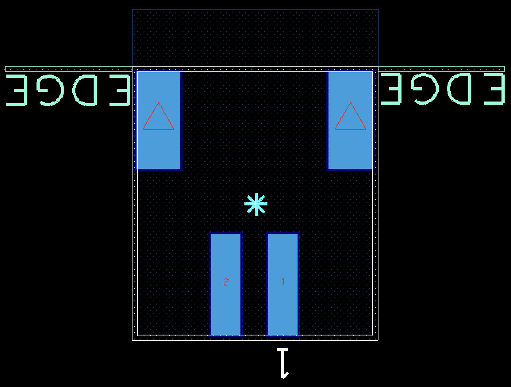
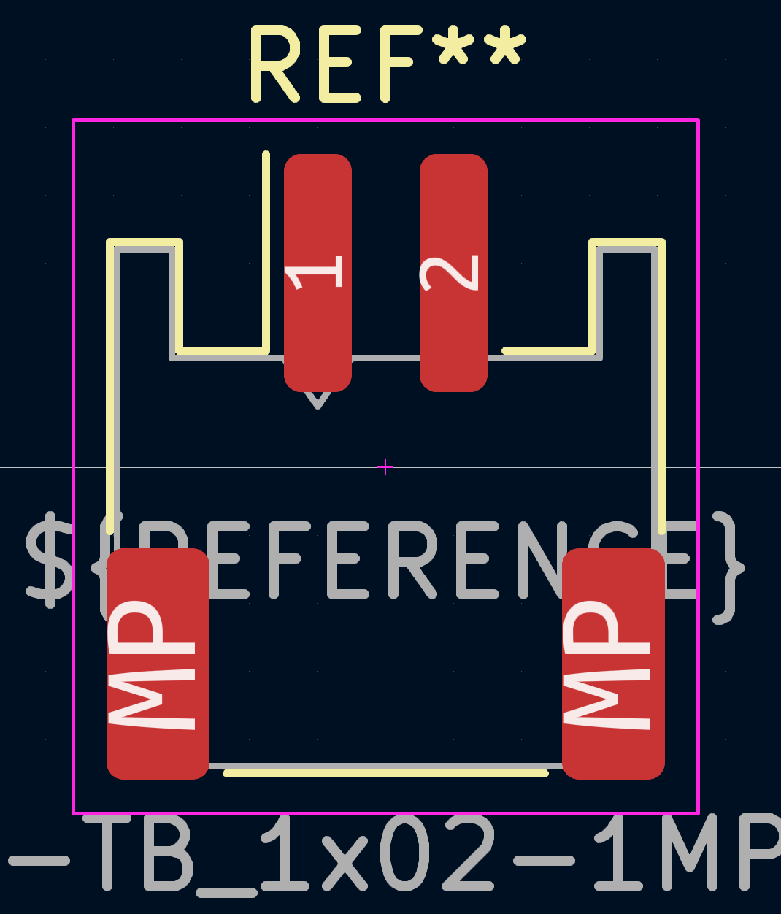

# Notecarrier-B

This folder contains the design files for the Blues Wireless Notcarrier-B, in KiCad 7 format. They were generated by porting the original OrCad design files.

## Porting Notes

### Project

- The revision history and block diagram sheets have not been ported, and instead have been extracted into more suitable formats.
	- The revision history is captured at the end of this README.
		- The mechanical symbols have been moved to the schematic sheet.
	- The block diagram is captured in XXX.

### Schematic

- For the appearance of nets, I am erring on the side of visually identical, rather than applying new KiCad conventions, since these can be interpreted as electrically significant and diverging may introduce doubt.
	- Eg. `VIO`, `VMODEM` power pins; power net thickness and colours; position of netnames.
	- Note the net appearance is visual only - no netclass is applied, in keeping with the original.
	- Note the original appears to have used arrow power symbols to indicate power "input" and bar power symbols to indicate power "output". Again, I've retained this visual-only information.
	- A notable exception is four-way junctions - I have avoided them.
- For symbols and graphical elements, I am porting to common KiCad conventions, since they're strictly visual and it's better for maintainability to suit the tool.
	- Eg. green generic nets; red on yellow symbols; blue dashed line boxes.
- For similar reasons, where it's significant to ERC or the BOM, I'm applying KiCad conventions.
	- Eg. adding electrical type to pins; adding `PWR_FLAG`s.
- The KiCad M.2 symbol had pin 38 as `NC38`. I corrected it to `AUX5`.
- The `S2B-PH-SM4-K-TB(LF)(SN)` part does not exist. The `S2B-PH-K-S` is the THT version of the `S2B-PH-SM4-TB(LF)(SN)`. I've substituted the latter.
- Some of the original text is Italian. I've not undertaken a translation, but where it may be confusing to English readers (eg. abbreviations on the schematic), a clarifying note has been added.
	- If the port were to be used for a new manufacturing run, this would be a good time to update the text since the BOM would need to undergo part substitutions for availability reasons anyway.
- In keeping with the decisions above, the BOM content has been ported accurately, rather than introducing KiCad conventions, improvements or translations.
	- Similarly, reference designators have been retained. Again, if the BOM were to be revisited, this information may warrant an update.
	- A notable exception is the exclusion of the PCB itself from the BOM. In keeping with the KiCad convention, the association with the PCB is a project-level attribute, rather than a schematic-level attribute.

### PCB

- Both the design and the physical sample exhibit the distinctive style of FAE: eg. black soldermask, no designators, rectangular non-solder mask defined pads, no guidelines on silkscreen, thick lines on fabrication layer. The footprints typical in a KiCad project are both visually different, and potentially electrically different. After some assessment, these differences were significant enough to warrant porting the footprints as well. Alas, a revisit of the available conversion tools confirmed they are not practical, introducing complications, missing details and producing difficult to maintain results. Further, the provided design files do not include the source library, so the footprints have to be extracted from the PCB design.
	- An example showing the differences between the two footprint styles is shown below for `J23`, the JST-PH LiPo connector.

| OrCAD | KiCad |
| ----- | ----- |
|  |  |

- 
	- Hence the decision has been made to redraw them all manually. Only insignificant visual aspects will use KiCad conventions, such as fonts. The guiding principle here is to ensure the gerbers are as similar as practicable, to aid in a representative and efficient validation.
		- If the port were to undergo a design revision, consider replacing all footprints with those from a trustworthy KiCad library to adopt fit-for-purpose conventions and maintainability.

### Validation Method

1. Validate Schematic
	1. Print both schematics at same scale.
	2. Perform visual comparison. Confirm that differences are expected, documented and acceptable.
1. Validate BOM.
	1. Export `Notecarrier-B BOM v2.1.xlsx` columns `Reference`, `Part`, `MPN`, `MPN2`, `Description`, `Temperature` and `Pkg Type` to CSV.
	2. Export KiCad BOM using Symbol Fields Table.
	3. Run BeyondCompare and match column headings.
	4. Confirm all differences are expected, documented and acceptable.

---

## Revision History

- **Rev A**: initial port from OrCAD design files, rev 14 (v2.1).

### OrCad Design File Revision History

Captured here instead of porting:

| Revision |    Date    |   Author   | Description |
|:--------:| ---------- | ---------- | ----------- |
|    12    | 25/08/2020 | G.Boschini | - Changed screw with inox version - Changed pullup resistor of EN pin to 10M |
|    14    | 25/08/2020 | M. Gregis  | - Added LiPO charger - Changed V+ to VBAT - removed BOOT signal from J21 header and replaced with GND - removed AUX5 from J22 header and replaced with VMODEM |

---

## References

- [PCB Design Repo](https://github.com/blues/note-hardware/tree/master/Notecarrier-B)
- [KiCad Library Repo](https://github.com/blues/blues-kicad-lib)
- [Notecard Datasheet, including M.2 Edge connector pinout](https://dev.blues.io/hardware/notecard-datasheet/note-wbex-500/)
- [Notecarrier-B Quick Start](https://dev.blues.io/quickstart/notecard-quickstart/notecard-and-notecarrier-b/)
- [Sensor Tutorial, including combinations of carrier and card (though not the -B)](https://dev.blues.io/guides-and-tutorials/collecting-sensor-data/notecarrier-a/blues-wireless-swan/circuitpython/)

### Library Contents

| Symbol | Footprint | Model |
| ------ | --------- | ----- |
|        | 9774025151R | 9774025151R (rev1) |
| BQ24210DQCT | BQ24210DQCT | BQ24210DQCT |
| CJS-1200TA | CJS-1200TA | |
| FSV1045V | | |
|        | JAE_SF72S006VBDR2500 | K3D-SF72S006VBD-V1\_JAE\_Proprietary |
|        |                      | K3D-SF72S006VBD-V1-S |
|        | JST_S2B-PH-SM4-TB(LF)(SN) | |
| MAX17225ELT | MAX17225ELT | |
| MDT420E01001 | MDT420E01001 | mdt420e0x001_c3d |
| PTS810-SJS-250-SMTR-LES | PTS810-SJS-250-SMTR-LFS | PTS810SJG250SMTRLFS |
| RND\_STNDFF\_M2.5X0.45\_STEEL\_2.5MM | | |
| S2B-PH-SM4-TB(LF) (SN) | | S2B-PH-SM4-TB |
|        | SAMTEC_TSM-112-01-L-SV | |
|        | SAMTEC_TSM-116-01-T-SV | |
| SF72S006VBDR2500 | | |
| TPS62748YFPT | TPS62748YFPT | TPS62748YFPT v1 |
| TSM-112-01-L-SV | | TSM-112-01-L-SV |
| TSM-116-01-T-SV | | TSM-116-01-T-SV |
| USB4105-GF-A | USB4105-GF-A | |
| USB4105-GF-A-ULTRA-LIBRARIAN | USB4105-GF-A-ULTRA-LIBRARIAN | |
| WS2812B-2020 | WS2812B-2020 | ws2812b-2020 v1 |
