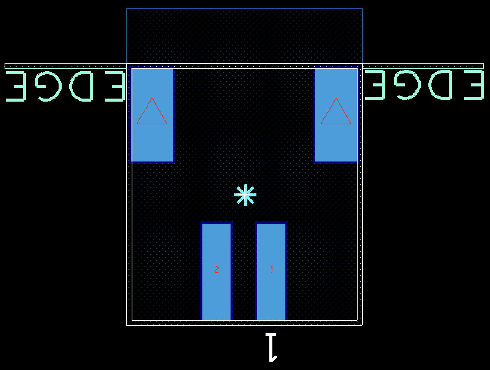
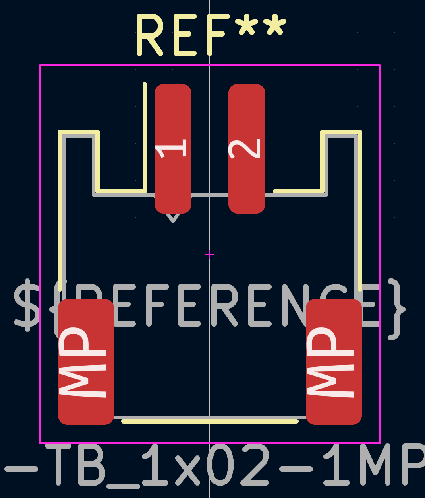

# Porting Notes

## Project

- The revision history and block diagram sheets have not been ported, and instead have been extracted into more suitable formats.
	- The revision history is captured at the end of the README.
		- The mechanical symbols have been moved to the schematic sheet.
	- The block diagram is captured in `Notecarrier-B_Block-Diagram.drawio`, in *diagrams.net* format.

## Schematic

- For the appearance of nets, I am erring on the side of visually identical, rather than applying new KiCad conventions, since these can be interpreted as electrically significant and diverging may introduce doubt.
	- Eg. `VIO`, `VMODEM` power pins; power net thickness and colours; position of netnames.
	- Note the net appearance is visual only - no netclass is applied, in keeping with the original.
	- Note the original appears to have used arrow power symbols to indicate power "input" and bar power symbols to indicate power "output". Again, I've retained this visual-only information.
	- A notable exception is four-way junctions - I have avoided them.
- For symbols and graphical elements, I am porting to common KiCad conventions, since they're strictly visual and it's better for maintainability to suit the tool.
	- Eg. green generic nets; red on yellow symbols; blue dashed line boxes.
- For similar reasons, where it's significant to ERC or the BOM, I'm applying KiCad conventions.
	- Eg. adding electrical type to pins; adding `PWR_FLAG`s.
- The KiCad M.2 symbol had pin 38 as `NC38`. I corrected it to `AUX5`.
- The `S2B-PH-SM4-K-TB(LF)(SN)` part does not exist. The `S2B-PH-K-S` is the THT version of the `S2B-PH-SM4-TB(LF)(SN)`. I've substituted the latter.
- Some of the original text is Italian. I've not undertaken a translation, but where it may be confusing to English readers (eg. abbreviations on the schematic), a clarifying note has been added.
	- If the port were to be used for a new manufacturing run, this would be a good time to update the text since the BOM would need to undergo part substitutions for availability reasons anyway.
- In keeping with the decisions above, the BOM content has been ported accurately, rather than introducing KiCad conventions, improvements or translations.
	- Similarly, reference designators have been retained. Again, if the BOM were to be revisited, this information may warrant an update.
	- A notable exception is the exclusion of the PCB itself from the BOM. In keeping with the KiCad convention, the association with the PCB is a project-level attribute, rather than a schematic-level attribute.

## PCB

- Both the design and the physical sample exhibit the distinctive style of FAE: eg. black soldermask, no designators, rectangular non-solder mask defined pads, no guidelines on silkscreen, thick lines on fabrication layer. The footprints typical in a KiCad project are both visually different, and potentially electrically different. After some assessment, these differences were significant enough to warrant porting the footprints as well. Alas, a revisit of the available conversion tools confirmed they are not practical, introducing complications, missing details and producing difficult to maintain results. Further, the provided design files do not include the source library, so the footprints have to be extracted from the PCB design.
	- An example showing the differences between the two footprint styles is shown below for `J23`, the JST-PH LiPo connector.

| OrCAD | KiCad |
| ----- | ----- |
|  |  |

- 
	- Hence the decision has been made to redraw them all manually. Only insignificant visual aspects will use KiCad conventions, such as fonts. The guiding principle here is to ensure the gerbers are as similar as practicable, to aid in a representative and efficient validation.
		- If the port were to undergo a design revision, consider replacing all footprints with those from a trustworthy KiCad library to adopt fit-for-purpose conventions and maintainability.
- After evaluating various methods of importing the PCB, and weighing up the accuracy and maintainability, have decided on this workflow:
	1. In OrCAD, make key layers visible one-by-one. Eg. TOP ETCH, then TOP VIA, then TOP SILKSCREEN, etc using the Setup --> Colors dialog (obviously...).
		2. Possibly include the outline if it helps with alignment, but should be able to do it with absolute placement instead.
	2. Export to DXF (Export --> MCAD --> DXF...) with options: 
		1. Name according to table below.
		1. Revision: 12, units: MM, accuracy: 4.
		1. Select the `ecad_mcad` layer conversion file from the library (if a default isn't provided), and edit it:
			1. Select all, then select "Use layer names generated from class and subclass names".
			2. Click "map".
			3. Click "OK", overwriting whatever was there because in characteristically obscure OrCAD fashion, other layers can otherwise appear in the exported file, and "just" removing layers from a DXF can be the start of a terrible nightmare.
		1. Don't bother with polyline or fill options since I've not found a combination which actually results in directly useable polygons. PS. can you imagine how long I spent trying to understand this insane dialog?
		1. Click Export.
	3. Import graphics in KiCad putting each export on a separate User layer, placing them all at the board origin, with 0.1mm line width and millimeter units.
	4. Trace over or convert them using native KiCad tools, to generate a high quality digital design that is physically equivalent to the original.
- OrCAD layer to KiCad layer mapping:

| OrCAD | KiCad | Notes |
| ----- | ----- | ----- |
| OUTLINE.dxf | User.1 | Could be Board geometry --> Design_Outline. Who knows? Includes edge cuts, edge clearance and dimension annotations. |
| ASSEMBLY-TOP.dxf | User.2 | RefDes is in Components. Courtyard is in Package Geometry. Courtyards sufficient to align components. |
| ASSEMBLY-BOT.dxf | User.3 | Courtyards sufficient to align components. |
| SILKSCREEN-TOP.dxf | User.4 | Again, check Geometry and Components. Text came through as text! So now needs to be repositioned because fonts are different. |
| SILKSCREEN-BOT.dxf | User.5 | Text came through as text! So now needs to be repositioned because fonts are different. |
| TOP-ETCH.dxf | User.6 | Fills came through as outlines, traces as thin lines. Will be used as guides for new elements. |
| BOT-ETCH.dxf | User.7 | Fills came through as outlines, traces as thin lines. Will be used as guides for new elements. |
| TOP-VIA.dxf | User.8 | Also includes test points, so need top and bottom. |
| BOT-VIA.dxf | User.9 | But doesn't include fiducials, so do them manually. |
| TOP/BOT-PIN.dxf | - | No useful information. |

- To convert the `ETCH.dxf` layers into tracks:
	- Hide all other layers. Select everything. Ungroup if necessary. Unselect any text.
	- Right click --> "Create from selection" --> "Create Tracks From Selection".
		- If "Create Tracks From Selection" doesn't appear, something other than lines (like text) is selected somewhere.
- To remove the flood fill outlines and correct the track widths (easier to do after creating the tracks, because scripting doesn't work well when changing the selection set or creating tracks):

```python
import pcbnew
pcb = pcbnew.GetBoard()
for t in pcb.GetTracks():
    if t.GetLayerName() != 'F.Cu':
        continue
    w = t.GetWidth()
    if w <= 20000:
        t.SetWidth(w*100)
    else:
        t.DeleteStructure()
```

- Failed attempt to modify the selection set:

```python
for d in pcb.GetDrawings():
    if d.GetLayerName() != 'User.7' or d.GetClass() != 'PCB_SHAPE' or d.GetWidth() > 10000:
        d.ClearSelected()
```

- One of the Front fiducials is out of place (it doesn't correspond with its Back pair and yet its keep out remains) assumedly to avoid fouling the connecter silkscreen. I've opted to retain the position, but allow the keep out to re-fill, which produces more copper (with no effect) but a visually similar PCB, keeping the more important details intact.
- The original flood fill is strange - it follows curves as if the minimum width is exactly 0.2mm, yet has a couple of stubs that are only 0.12mm wide. I've stuck with the 0.2mm since it has the majority effect, and sacrificed the couple of small stubs.
	- I've now reversed this decision - following the curves turns out to be a far less significant difference compared to the stubs.
	- Still need lots of rule areas to tidy up the exceptions and limit the flood fill to match the original. The rules change from part to part, so much easier to add rule areas than try to edit clearance settings.
- Place vias by generating a drill report (Export --> Reports --> New/Edit --> Database View = `FULL_GEOMETRY` --> Double click `DRILL_HOLE_NAME`, `DRILL_HOLE_PLATING`, `DRILL_HOLE_X` and `DRILL_HOLE_Y` --> Ok --> Generate Reports --> Save --> "drill_report.html"), opening in a browser and copying the contents into a spreadsheet, sorting by plating and then by name, calculating x+100 and 100-y, copying values into a text editor to create python code to generate lists (eg. `p = [(x,y),...]`) for each drill size, creating a via with the correct properties, duplicating it to get the right number, then running something like this:

```python
i=0
for t in pcb.GetTracks():
    if t.IsSelected():
        t.SetPosition(pcbnew.VECTOR2I(pcbnew.wxPoint(p[i][0]*1000000,p[i][1]*1000000)))
        i += 1
```

- and this:

```python
for t in pcb.GetTracks():
    if t.IsSelected():
        t.SetNet(pcb.FindNet("GND"))
```

- Place test points in a similar way using Export --> Quick Reports --> Testprep Report, extracting the ref des info as well as x and y, and using something like:

```python
i = 0
for t in pcb.GetFootprints():
    if t.IsSelected():
        t.SetPosition(pcbnew.VECTOR2I(pcbnew.wxPoint(x[i]*1000000,y[i]*1000000)))
        t.SetReference(r[i])
        i += 1
```
	- Note introducing test points in the PCB is not typical of a KiCad project, which usually defines them in the schematic. Not having them in the schematic produces a warning in KiCad, but we can safely ignore it since they have been created according to a sound OrCAD workflow and we're copying them and their metadata faithfully.
	- However, without OrCAD's testpoint report, it's difficult to extract the metadata in the same way. If the testpoints were in the schematic, then the information would be in the netlist and easy to extract with something like [this](https://github.com/Peboli/kicad_netlist_tp_parser). All the information is contained in KiCad's "Component Placement" and "Footprint Report" under "File --> Fabrication Outputs", but these files are not fit for purpose right out of the box. To preserve the *availability* as well as the existance of this data from the OrCAD source files, a script to extract and present it is included in the Validation section.
- The M.2 connector locating holes in the OrCAD design are excluded from the copper layers. They're drilled out anyway so it makes little difference, but the KiCad standard is to leave them in (avoiding a redundant action). Since it makes little difference, and the footprint is custom anyway, I've adopted the OrCAD method.
- The fiducials in OrCAD have a paste layer. I'm comfortable excluding that since it clearly serves no purpose.
- The "Manufacturing Specifications" on the PCB mention a thickness of "1.6mm". The stack-up doesn't add up to this and I can't see a justification for it, so am assuming it's just a nominal figure. In KiCad the thickness reported is from the stack-up, so I've left it as "1.57mm".
	- The "Manufacturing Specifications" also mention a "Copper Thickness Base" of 35um. Again, I can't see this justified anywhere, since the copper layers are given as 0.018mm. I've adopted the 0.018mm figure and not included the 35um figure.
	- In general I haven't tried to recreate the appearance of the drawing sheet, since it has little effect on the design and is not a important part of the ongoing maintainability as a KiCad project. Instead, I have added some useful field data to the default drawing sheet template, and added a few additional elements to the User.Drawings layer to broadly capture the nature and any key details in the OrCAD originals.
- Pin 6 of the M.2 connector (`J20`) is assigned to `GND` but is not connected in the PCB. This apparent oversight has been retained.
- 3D models were a nightmare to extract. The only effective method I found was to load the supplied `Notecarrier-B 3D model v2.1.stp` full board model into Fusion360 and export each component one by one.
	- Even this wasn't complete, since the non-populated components aren't included. I was able to find them in `Notecarrier-B 3D model v1.6.stp` using the same method.
	- The `CS-C-1206` model looks funny. It seems to be on its side and off centre. All others seem okay though, so will retain this one.
	- The `S2B-PH-SM4-TB(LF)(SN)` model (for the `J-2-0200-MOS-S2B` footprint) was missing. Funnily enough it's missing in the KiCad library too. I found one on SnapEDA to use.


## Validation Method

1. Validate Schematic
	1. Print both schematics at same scale.
	1. Perform visual comparison. Confirm that any differences are expected, documented and acceptable.
1. Validate BOM.
	1. Export `Notecarrier-B BOM v2.1.xlsx` columns `Reference`, `Part`, `MPN`, `MPN2`, `Description`, `Temperature` and `Pkg Type` to CSV.
	1. Export KiCad BOM using Symbol Fields Table.
	1. Run BeyondCompare and match column headings.
	1. Confirm all differences are expected, documented and acceptable.
1. Validate PCB.
	1. Run DRC. Confirm that any errors and warnings are expected, documented and acceptable.
	1. Produce the Testpoint Report from OrCAD via Export --> Quick Reports --> Testprep Report, and ensure all test points are accounted for and accurate.
	1. Painstakingly create a film for each gerber layer in OrCAD by:
		1. Setup --> Colors --> Off, then use "Filter layers" and the "Stack-Up" tree to only enable:
			1. Design_Outline
			1. Pin/Top, Via/Top, Etch/Top
			1. Pin/Bottom, Via/Bottom, Etch/Bottom
			1. For any inner layers, where "Inner" is the name of the layer:
				1. Pin/Inner, Via/Inner, Etch/Inner
			1. Pin/Pastemask_Top, Via/Pastemask_Top, PackageGeometry/Pastemask_Top
			1. Pin/Pastemask_Bottom, Via/Pastemask_Bottom, PackageGeometry/Pastemask_Bottom
			1. Pin/Soldermask_Top, Via/Soldermask_Top, PackageGeometry/Soldermask_Top, BoardGeometry/Soldermask_Top
			1. Pin/Soldermask_Bottom, Via/Soldermask_Bottom, PackageGeometry/Soldermask_Bottom, BoardGeometry/Soldermask_Bottom
			1. All/Silkscreen_Top
			1. All/Silkscreen_Bottom
		1. Ok -> Export -> Gerber -> Right-click a film and choose "Add" with names like:
			1. Edge_Cuts
			1. F_Cu
			1. B_Cu
			1. In1_Cu, In2_Cu, etc., if applicable.
			1. F_Paste
			1. B_Paste
			1. F_Mask
			1. B_Mask
			1. F_Silkscreen
			1. B_Silkscreen
	1. Produce Gerbers in OrCAD and KiCad using the same settings. In OrCAD, select each of the new films, offset **each** film by (100,-100) to end up in the same spot as KiCad, and click "Create Artwork".
		1. 	Edge_Cuts also needs an "undefined line width" set (say, 0.1) so the zero width edge is not dropped.
	1. Produce drill files using Export -> NC Drill. Parameters that must be set are the offset (same as gerbers), "Auto tool select", "Separate files for plated/non-plated holes", and "Enhanced Excellon format". But "Repeat codes" must not be set. 
		- Looks like "Output units: English" only works with format 2.5 (it seems a 0.0254mm limit on resolution is noticeably imprecise). To use metric (to match the KiCad gerbers), format must be 3.4.
		- On the other hand, "Absolute" vs "Incremental" is not important. Nor is zero suppresion.
		- Unfortunately, this still doesn't capture slots. They need their own separate file, which can be produced easily in Export -> NC Route.
	1. Open pairs of the gerbers in Gerber Viewer and flick between them to scan for differences. The contrasting colours of the layers automatically creates a useful visual diff, and is more definitive than the "diff" and "xor" views.
	1. Validate the non-manufactured layers by selecting the "MANUFACTURING" view in OrCAD, and visually comparing with the equivalent in KiCad.


## Produce Outputs

Now the validation method has been refined and the design has reached maturity, the following method allows for easy, repeatable generation of the artefacts used for validation. A fast, reliable method is important to ensure the validation is not undermined by small on-going tweaks.

1. Prerequisites:
	1. KiCad 7 (download from http://www.kicad.org)
	1. gerbv and Imagemagick (`brew install gerbv imagemagick`)
	1. The gerber comparison method is from my work on GrbDiff (https://www.github.com/hraftery/GrbDiff/) but the tool itself is not directly applicable.
1. Proof schematic:
	1. Open schematic in KiCad.
	1. File --> Plot
	1. Set output directory to "documentation", set output format to "PDF", page size to "Schematic size", check "Plot drawing sheet", output mode to "Color", and click "Plot All Pages".
	1. Append "_RevX" to the filename, where "X" is the current schematic rev.
1. Produce BOM:
	1. Open schematic in KiCad.
	1. Tools --> Edit Symbol Fields
	1. Click "Export as CSV".
	1. Append "_RevX" to the filename, where "X" is the current schematic rev, and save in the "validation" folder.
		- Note this is not an ordering BOM. It is a raw table of all symbol fields, including non-BOM items, and is useful primarily for validation purposes.
1. Produce testpoint report:
	1. Open pcb in KiCad.
	1. Run the following script (the `if True` allows it to be copy/pasted into the pcbnew console) and copy the output into "output/testprep.md" (after running `import pcbnew` and `pcb = pcbnew.GetBoard()`):
	
	```
	if True:
	    print("| {:<6} | {:<4} | {:<8} | {:<7} |  {:<21}  |".format("RefDes", "Side", "X", "Y", "Net"))
	    print("|--------|------|----------|---------|-------------------------|")
	    for f in pcb.GetFootprints():
	        if f.GetValue() == "TPS-SPEA":
	            refdes = f.GetReference()
	            layer = f.GetLayerName()
	            side = "Top" if layer == "F.Cu" else ("Bot" if layer == "B.Cu" else layer)
	            x = round(f.GetX()/1000000, 4)
	            y = round(f.GetY()/1000000, 4)
	            net = f.Pads()[0].GetNetname().lstrip("/")
	            print("| {:<6} | {:<4} | {:8.4f} | {:7.4f} | `{:<21}` |".format(refdes, side, x, y, net))
	```
1. Proof PCB:
	1. Open pcb in KiCad.
	1. Make `F.Cu` the active layer.
	1. File --> Print
	1. Select all layers except "User.1" through "User.9"
	1. Set output mode to "Color", check "Print drawing sheet" and "Print background color" but uncheck "Print according to objects tab of appearance manager" and "Use a different color theme for printing". Set drill marks to "Real drill", and uncheck "Print mirrored" and "Print one page per layer".
	1. Click print, then save as PDF to "validation/proof.pdf".
1. Generate Gerbers:
	1. Open pcb in KiCad.
	1. File --> Plot
	1. Set plot format to "Gerber" and output directory to "manufacturing".
	1. Include layers "F.Cu", "B.Cu", "F.Paste", "B.Paste", "F.Silkscreen", "B.Silkscreen", "F.Mask", "B.Mask" and "Edge.Cuts".
	1. Exclude all layers from "Plot on All Layers".
	1. Uncheck "Plot drawing sheet" and "Force plotting of invisible values / refs", "Check zone fills before plotting", "Use drill/place file origin", and "Do not tent vias".
	1. Check "Plot footprint values" and "Plot reference designators".
	1. Set coordinate format to "4.6, unit mm".
	1. Uncheck "Use Protel filename extensions", "Subtract soldermask from silkscreen" and "Disable aperture macros".
	1. Check "Generate Gerber job file", "Use extended X2 format" and "Include netlist attributes".
	1. Click Plot.
	1. Click Generate Drill Files
	1. Select "Excellon" drill file format.
	2. Uncheck "Mirror Y axis", "Minimal header" and "PTH and NPTH in single file".
	1. Set "Absolute" drill origin, "Inches" drill units and "Decimal format" zeros format.
	1. Click "Generate Drill File".
1. Produce Gerber diffs:
	1. Re-generate PNGs from the Gerbers and create visual diffs by running these commands in `zsh` from the "validation" directory.
		- The equivalent PNGs for the OrCAD gerbers were generated in a similar way, using the gerbers generated in the **Validation** section. Note however `gerbv` must be explicitly told the file format for the drill files is "5" digits (or the gerbers re-generated with the format set to "2.4" instead). Since specifying the file format cannot be scripted, and non-scripted exports are anti-aliased, `gerbv` was first used to manually open the drill files and re-export them as gerbers first, so then the command line `gerbv` can be used on all the gerbers at once.
	
	```
	set -k # turn on commenting support
	for f in ../manufacturing/*.(gbr|drl)
	do
	fname=${${f:t:r}:14} # strip off path, extension, and "Notecarrier-B" prefix
	gerbv --background=#FFFFFF --foreground=#00690B --foreground=#00690B "../manufacturing/Notecarrier-B-Edge_Cuts.gbr" "$f" --export=png --dpi 1200 -o "${fname}-KiCad.png"
	convert \( ${fname}-KiCad.png -grayscale Rec709Luminance \) \
            \( ${fname}-OrCAD.png -grayscale Rec709Luminance \) \
            \( -clone 0-1 -compose darken -composite \) \
            -channel RGB -combine ${fname}-diff.png
	done
	```

## Libraries

The `blues-kicad-lib` was initially reviewed and the list of contents tabled below. Part of the scope of work is to correct the M.2 connector part, but the usefulness of the other parts is not known. While there is potentially some valuable work here, the inconsistent symbol conventions, slightly obscure naming conventions, missing pin types and the unpredictable overlap with the requirements of the Notecarrier-B port has warranted creation of a bespoke library. This has allowed confident and fast execution, without the distraction of third-party dependencies, and allows quality and consistency to be controlled.

Nonetheless, now that one port is complete and the next started, there is clearly valuable overlap between parts in each design (even between OrCAD and Altium projects). Thus, it makes sense to consolidate libraries.

The existing library contents, the needs of the porting project and the future maintainability of the design files, were all assessed to determine an effective way forward. The approach taken is to carefully document the original contents in the table below, and then add all new parts to the library as required by the porting process, overwriting existing parts where there is a name clash. This will allow the source control history will track and retain the provenance of each part, highlight the deliberate nature of the new parts, provide an easy and predictable way to share parts between projects, and retain the existing naming and location conventions of the library.

Further, where new parts are introduced, paths will be made relative to ensure the library can be used by others. It is noted that existing parts contain absolute paths, but correcting this is out of scope.

A README has been added to the library to explain important usage requirements associated with configuring paths, and detail the motivation for the choices made. Note that KiCad produces self-contained project files, so if a user opens the project without access to the library, they will be warned but can still proceed. All content will still be available, except 3D models. An explanation of this phenomena is included in the library README, and a reference to the library made in each project's README.

As an aside, moving the drawing sheet file into the library was also considered, since it is also common to all projects. However, unlike other library content, the user experience if you do not have access to the library is poor - when opening the schematic, KiCad warns about the missing file but also substitutes a generic drawing sheet, which results in an ugly and incorrect mess. Instead, the file could be moved into a shared location within the current repository, but the same doubts remain - if the link to the file is ever broken, or it is modified to suit future needs, all existing schematics are affected. Furthermore, having a common file which is specific to a third-party contractor may appear strange. Thus the decision was made to make it local to each project, and name it according to the project as per the KiCad convention.


---

## References

- [PCB Design Repo](https://github.com/blues/note-hardware/tree/master/Notecarrier-B)
- [KiCad Library Repo](https://github.com/blues/blues-kicad-lib)
- [Notecard Datasheet, including M.2 Edge connector pinout](https://dev.blues.io/hardware/notecard-datasheet/note-wbex-500/)
- [Notecarrier-B Quick Start](https://dev.blues.io/quickstart/notecard-quickstart/notecard-and-notecarrier-b/)
- [Sensor Tutorial, including combinations of carrier and card (though not the -B)](https://dev.blues.io/guides-and-tutorials/collecting-sensor-data/notecarrier-a/blues-wireless-swan/circuitpython/)

### Original Library Contents

| Symbol | Footprint | Model |
| ------ | --------- | ----- |
| BQ24210DQCT | BQ24210DQCT | BQ24210DQCT |
| CJS-1200TA | CJS-1200TA | |
| FSV1045V | | |
| MAX17225ELT | MAX17225ELT | |
| MDT420E01001 | MDT420E01001 | mdt420e0x001_c3d |
| PTS810-SJS-250-SMTR-LES | PTS810-SJS-250-SMTR-LFS | PTS810SJG250SMTRLFS |
| RND\_STNDFF\_M2.5X0.45\_STEEL\_2.5MM | 9774025151R | 9774025151R (rev1) |
| S2B-PH-SM4-TB(LF)(SN) | JST_S2B-PH-SM4-TB(LF)(SN) | S2B-PH-SM4-TB |
| SF72S006VBDR2500 | JAE_SF72S006VBDR2500 | K3D-SF72S006VBD-V1\_JAE\_Proprietary |
|        |                      | K3D-SF72S006VBD-V1-S |
| TPS62748YFPT | TPS62748YFPT | TPS62748YFPT v1 |
| TSM-112-01-L-SV | SAMTEC_TSM-112-01-L-SV | TSM-112-01-L-SV |
| TSM-116-01-T-SV | SAMTEC_TSM-116-01-T-SV | TSM-116-01-T-SV |
| USB4105-GF-A | USB4105-GF-A | |
| USB4105-GF-A-ULTRA-LIBRARIAN | USB4105-GF-A-ULTRA-LIBRARIAN | |
| WS2812B-2020 | WS2812B-2020 | ws2812b-2020 v1 |
