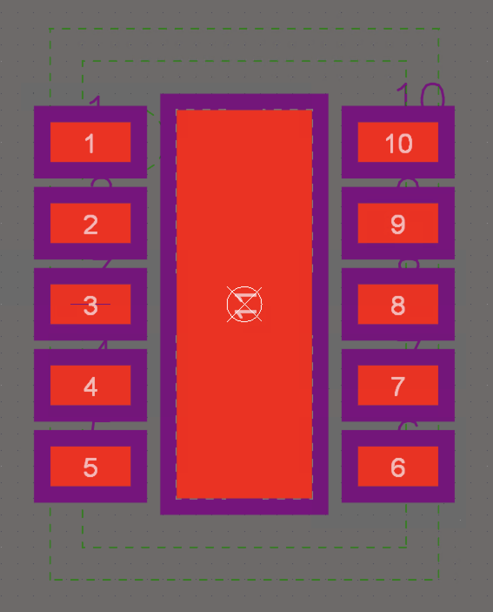
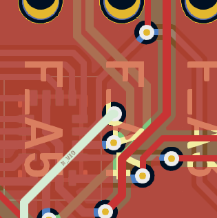
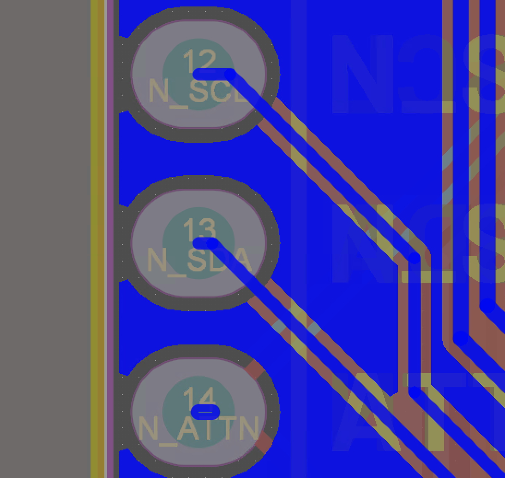
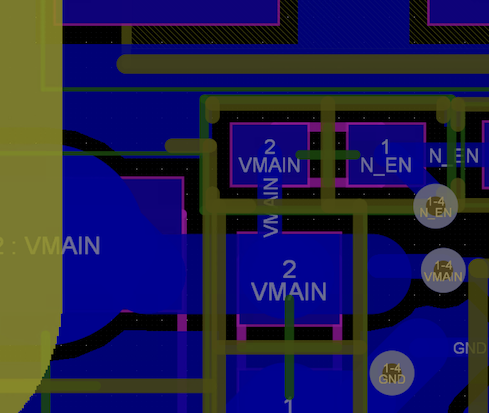
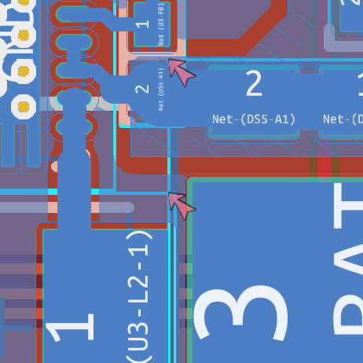
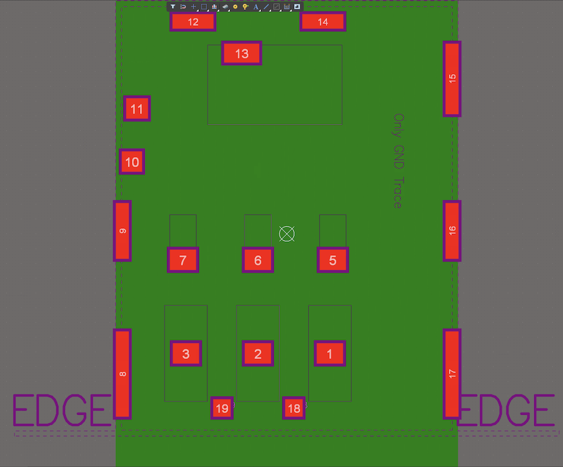

# Porting Notes - Notecarrier-F

As per [Notecarrier-B](../../../Notecarrier-B/KiCad_format/documentation/PortingNotes.md), except:

## Schematic

- This is an Altium port, not an OrCAD port.
- The input/output power net distinction does not apply, so I'm switching to the KiCad arrow convention instead of the Altium circle convention, and using KiCad symbols where they exist, since the interpretation is clear.
	- That said, the `VBAT` symbol is already an arrow. I can find no explanation for the distinction, so am ignoring it.
	- Same goes for `F_BAT` and `N_VIO`, which is (sometimes) a bar!
	- Sadly this is also true of the chassis/earth symbols that are labelled `GND`. They are a distinction without apparent meaning, so I've opted to replace them with arrow `GND` symbols.
- Once again, I'm ensuring symbols and footprints adhere to the existing design, rather than imposing KiCad or other industry standards. This means doing the hard work up front of replicating the source design, rather than simply substituting existing library components. Therefore, design risk is minimised as a first priority, but an easy path is left open to apply more standard conventions down the track.
- There's little advice on signal flow: inputs and outputs are scattered a bit haphazardly and functional blocks are overlapping and unlabelled. So at times I've had to be a bit inventive to group and label things into functional boxes. I've erred on the side of retaining as much parity with the original as possible, as to not inadvertently introduce confusion, but still add some neat blue boxes and illuminating labels wherever possible.
	- Together with the top level sheet I've introduced, this should result in a significantly easier to understand schematic, that is nonetheless a clear reproduction of the original.
	- However it wasn't always possible to have hierachial labels on the outside of the boxes without substantial re-routing. In these cases I've compromised and left the hierarchial labels inside the functional blocks.
- Some options for porting the original Off-Sheet Connectors were considered. To recap, Altium has three net name scopes: Net Labels (default to local to sheet), Off Sheet Connectors (global to schematic), and Ports (can be shared amongst sheets using hierarchal connections). The source files used Net Labels and Off Sheet Connectors exclusively, and no hierarchy. A like-for-like port would have used KiCad Labels for the Net Labels, and Global Labels for the Off Sheet Connectors. However, to leverage KiCad's ERC during the port, and create a KiCad project that is both maintainable and verifiably equivalent to the original, the decision was made to port all the Off Sheet Connectors as Hierarchial Labels, so a hierarchy could be introduced.
	- To return to a like-for-like port, the top-level sheet can simply be deleted and all Hierarchial Labels replaced with Global Labels with the same name. The reverse operation cannot be done automatically, since it requires the creation of the top-level sheet. Thus, this port represents a strictly better alternative, since the like-for-like port can be automatically derived from it.
	- Ultimately, this process was not sufficient to port the design. It turns out several of the Net Labels actually need to be global, and this was achieved in Altium by setting the "Net Identifier Scope" setting to "Automatic". Since there is no hierarchy in the original design, this automatic setting makes *all* labels global.
		- KiCad does not have an equivalent setting, and using Global Labels in place of the Labels not only sacrifices the advantages of the hierarchy, it also produces an unattractive result due to the different visual geometry of a Global Label. Thus, an extra "Label Promotion" section was added to sheets where necessary, to promote to Hierarchial Labels those Labels that require inter-sheet connectivity.
		- This means the port remains true to the original, with additional data to indicate the global nature of some of the labels.
		- Even if the hierarchy was scrapped, the promotion would be necessary. The only difference would be the Labels would be promoted to Global Labels instead of Hierarchial Labels.
		- There is one instance where things are the other way around: `F_NRST` is a Off Sheet Connector in the original, but is not used off sheet. I have left it as is, and it produces the only error in the ERC for posterity.
- A minor one, but came up a lot: in KiCad net labels are anchored at either the start or end of the text, and nets themselves indicate they have not been terminated (eg. with a net label) with a little empty box. This prompts quality control conventions like using net labels to terminate the right or left of nets, rather than adding them at arbitrary locations along the net. That means labels on nets that terminate to the right will be aligned on their right side, with a staggered left side according to the length of the label. I have opted to adopt this KiCad convention, since it is cosmetic only, and prevents the non-conventional and doubt-inducing empty boxes.
- KiCad symbols must be annotated (ie. the reference designator starts with a letter and ends with a number) for various functions to work like ERC and synchronising the schematic with the PCB. Thus for ease of use I've renamed `MOD1L` to `MODL1` and `MOD1R` to `MODR1`, since I can't see any possibility for harm.


## PCB

- This is an Altium port, not an OrCAD port.
	- Significantly, this means that using KiCad's import into `pcbnew` feature is very effective. There is still too much lost in translation to use as a starting point, however this is still a simpler and more accurate way to create the pcb polygons than the gerber-to-kicad-via-DXF method used for the OrCad Notecarrier-B project.
		- This technique was used to create the entire Edge.Cuts, User.Comments (dimensions) and copper layers by copying, pasting and positioning.
			- The dimensions layer then just needed work to correct fonts and labels positions.
			- The copper layers mostly only needed pour settings corrected.
			- Other layers like silkscreens and manufacturing instructions are dominated by elements like text fields that don't port well, so they were created manually.
			- Non-layer elements like drills and components were done in a similar manner to the OrCAD port: create/generate native equivalents and then position/configure them with the help of scripts.
		- For the record, warnings during import were:
			- Altium layer 72 moved to Eco1_User
			- Altium layer 71 moved to Eco1_User
			- OBJ1 pad 1 complex pad stack not supported.
			- Ignored polygon shape of kind 2.
- The meaning of the dozens of Altium layers is a well-known source of ambiguity. I was guided by the actual content, and when in doubt generally used these two mappings: [common](https://blog.mbedded.ninja/electronics/general/altium/altium-tricks-and-standards/#pcb-layer-standards) and [uncommon](https://www.ninedotconnects.com/back9-mechanical-layers), neither of which really lined up much at all.
	- Still, I never did figure out what "Mechanical 255" was, and many of the others seemed fluid, to put it charitably.
- I'm a bit confused by `U2`, the `BQ24210DQCT` with the `WSON10-EXP` footprint. Not only does it have strange fonts in its labels on the schematic, Italian field names and a visible order number, the footprint has no silkscreen, solid regions with "Kind" unspecificed (that appear as dashed lines), paste orifices that are filled in by other paste polygons, only 0.05mm between solder mask openings, no Mechanical 13 layer elements (typically used for body outline), no Mechanical 15 layer elements (typically used for courtyard and origin cross-hair), and has pin numbers on Mechanical 26! The footprint appears the same in the PCB, yet in the assembly drawing on page 7 of `n21-evt_2022-05-20_assembly.PDF` the part has an effective outline and label.
  - I'm going to assume this is a one-off poor quality import from a FEA OrCAD project, replicate the critical elements from the manufacturing layers (silkscreen, copper, paste, etc), but create sensible BOM metadata and fabrication/assembly layers. In particular, for the symbol I'm going to translate the BOM fields to those used by other parts. And for the footprint I'm going to ignore Mechanical 26, and create courtyard and body outline (fab) layers.

| U2 Symbol | U2 Footprint |
| --------- | ------------ |
|  |  |


- Altium can't natively generate a drill report like OrCAD. Two options are to parse the NC Drill file, or extract the drill coordinates from the imported PCB file. I've opted to do the latter for expediency. Something like (after setting the selection filter to vias and selecting all):

```
for t in pcb.GetTracks():
    if t.IsSelected():
        print(f"{t.GetWidth()};{t.GetDrill()};{t.GetPosition()}")
```

- The source PCB used the "Barlow (Semibold)" font heavily, such as in the silkscreen. I've been able to obtain a copy from Google Fonts and create equivalent text artefacts. However it is not appropriate for me to distribute the font with the design, so users will need to obtain and install the font themselves.
	- On the other hand, I was [not able](https://www.eevblog.com/forum/kicad/vector-fonts/msg4836302/#msg4836302) to obtain a copy of the Altium "Default" font, which tended to be used for things like dimension labels. I tried a few alternatives and found KiCad's native font was the closest. Since the usage of the font does not affect the PCB itself, I'm satisfied with the substitution.
	- Same story for the manufacturing instructions and fabrication notes. The source file tends to use Altium's "Sans Serif" font. I've substitued KiCad's native font.
- The PCB had lots of tracks only connected at one end - short stubs (even one zero length one!) on top of vias and pads. They have no effect, except to flag DRC warnings, so I've deleted them.
	- The PCB has a few vias that only have one track connected, meaning they go nowhere. Although they have no obvious electrical function (except maybe as test points?), they consist of real copper so I have left them and added exclusions in the DRC.

| Unconnected ends example | Via with one connection example |
| --------- | ------------ |
|  |  |

- The copper pour settings in the original design specify islands are to be removed if they're less than 1.613 sq.mm. However, many of the pours *also* have "Remove Dead Copper" set. KiCad makes no distinction, so I've changed the setting on those pours that require it to "Always".
	- For those pours that do not have "Remove Dead Copper" set, a lot of isolated copper fills exist. I've checked these are all as intended, and then turned off the DRC warning to suit.
	- Altium's "Remove necks less than" setting for pours seems to have miscalculated in a few places. For example, there is room for a 0.134mm neck between the `F_D11` and `F_D12` tracks on the second inner layer, but with a setting of 0.127mm it does not appear. Same goes for between `L2` and `DS5`. I have adjusted the setting in KiCad to 0.14mm for these pours only to compensate.

| Pour island | Severed neck |
| --------- | ------------ |
|  |  |

- A couple of courtyards overlap. This was either true in the original, or true now that footprints have been consolidated in the library. In both cases, an exclusion has been added to the DRC, since the design remains faithful to the original.

| Existing overlapped courtyards | New overlapped courtyards due to new `TO277` footprint. |
| --------- | ------------ |
|  |  |

- Silkscreens overlap a lot, despite there being an explicit SilkToSilkClearance design rule of 0.127mm. I've left the design rule in but turned off the warning so DRC is not awash with meaningless warnings.
- In the original design, clearance around fiducials is managed with a specific design rule. In KiCad we can do that as a footprint setting, which has the same effect and is both more [appropriate](https://www.eevblog.com/forum/altium/fiducials/msg1274268/#msg1274268) (because the scoping is more accurate and because having a mask opening wider than the clearance leads to DRC warnings) and more in keeping with KiCad conventions. So I've added it to the footprint instead.
	- Similarly, the `PolygonConnect_GND` rule has condition `InNet('GND') And HoleDiameter<=0.45`. Yet it applies to all of the `NetC4_1` pour on the top layer, which is neither `GND` nor has holes less than 0.45mm diameter. Rather than debugging, I've opted to not use a design rule and apply the settings to the zone instead.
- Note that "Minimum annular width" should be set to 0 to mimic the absence of a corresponding rule in the source, but due to a [bug](https://gitlab.com/kicad/code/kicad/-/issues/13822) I've set it to 0.01 instead. The bug is fixed already but not available in KiCad v7.0.2. It should be available in a version soon.
- Note KiCad pours thermal reliefs with a spoke angle of 45° by default. The source pours tend to have a setting of 90° spokes. Alas, there is no such pour setting in KiCad, but I've accommodated by applying the setting to the pads in the footprints where it matters.
- Painfully, the `FIDUCIAL` footprint is 0.065mm off centre. This is done in Altium by offsetting the pad from the "hole". Since there's actually no hole, this is not possible in KiCad in the same way. But the difference is clearly visible in the gerbers and the precise location of fiducials is important. So I've elected to locate the pad offset from the footprint centre in KiCad, which has the same effect. Watch out - that means the rotation of the fiducial changes its location!
- Unlike Notecarrier-B, the locating holes in the M.2 connector are *included* in the outer copper layers. But in this case they're also NPTH with pads smaller than the hole. KiCad automatically strips the copper from the hole of a NPTH if the pad is the same or smaller size. The copper is retained for PTH, or for pads larger than the hole, but this also has an impact on the manufactured product. Since copper in a hole is ultimately unimportant to the manufactured product, I've opted to leave them as NTPH and acknowledge the difference in gerbers.
	- Same goes for the mounting holes.
	- The *opposite* is true of PTHs and vias! Altium excludes the copper if unconnected while KiCad leaves it. This is relatively easy to change - I've updated all vias and relevant pads to have annular rings for "Front, back and connected layers only".
		- But, Altium then applies a funny clearance rule - it seems to pretend the annulus/pad is still there, and then apply the global 0.15mm clearance.
		- For PTHs, this is very hard to mimic since not all pads are round or centred around their hole. So for PTHs I've reverted to leaving the copper there, and have just acknowledged it in my validation. Unlike the mounting holes, this *will* have an impact on the manufactured product, leaving small invisible pads around the inners layers of PTHs. This effect is expected to be unnoticeable, except perhaps a very small extra heatsink on those pins.
		- For vias, I've mimiced the clearance behaviour by calculating each via's effective clearance as "0.15 + (via size - hole size) / 2" and creating a custom rule for each via size, like so:

```
(rule Cu2Via127
   (constraint hole_clearance (min 0.4295mm))
   (condition "A.Type == 'Zone' && B.Type == 'Via' && B.Diameter == 1.27mm"))
(rule Cu2Via100
   (constraint hole_clearance (min 0.4mm))
   (condition "A.Type == 'Zone' && B.Type == 'Via' && B.Diameter == 1.0mm"))
(rule Cu2Via045
   (constraint hole_clearance (min 0.275mm))
   (condition "A.Type == 'Zone' && B.Type == 'Via' && B.Diameter == 0.45mm"))
```

- The Altium source has the "GPS ANT" silkscreen on two rows, but the gerbers and the physical sample I have have it on one. I'm going to assume the source is wrapped wrong because the correct font is not available, and put it on one row.
- In comparing non-manufactured layers, some acknowledgements:
	- Designators on the Fab layer appear inconsistently. In the source files this information is not part of a visible layer, yet it appears in the `n21-evt_2022-05-20_assembly.PDF` file. In both cases all the information exists, but in KiCad the convention of it being visible in the footprint only applies to those footprints that didn't originate from the source files (eg. `TO277-3` and `BQ24210DQCT`).
		- If a convention were to be established for visible designators, it could be applied at the library level and back ported into the design relatively easily.
	- The visible drill table has not been ported. It is not a conventional thing to do in KiCad and the information is better accessed other ways.
	- KiCad's version of a stack-up table and board characteristics table have been substituted.
	- The impedance control table has been manually recreated, since the information is important and is difficult to source in other ways.
	- As in Notecarrier-B, the sheet title block itself hasn't been given much attention since it serves little purpose. Just the important details like names, copyrights and versioning information has been applied.
- Not only is the `TO277-3` footprint not in the project pcblib (it's in "notecarrier-afv2-V1I1.PcbLib" which is not available), one of the instances is different to the others! Pad 3 of `DS4` is shifted left compared to the other footprints, relative to pads 1 and 2. This is most obvious in the validation of the `B_` layers. It has little effect, and is obviously not desirable, so has been acknowledged and not ported.
- The source footprint for the fiducial numbers the pad "1". In KiCad this is used to indicate it is an electrical pin. Since it serves no electrical purpose, and creates a number of warnings, I've adopted the KiCad convention and removed the pad number.
	- Similarly for `JST SM04B-SRSS-TB` and `JST S2B-PH-SM4-TB` footprints. They had pads named "M", which are mechanical only. I've removed the pad names.
- The footprint for `MOD2` doesn't make much sense to me (and the symbol only barely, to be fair), so I've just left it be. It produces lots of warnings about there being no correspondance between the pins and the pads.

## 3D

- The KiCad importer produced the wrong model for the `1285AS-H-2R2M=P2-INDC2016X100N` inductor footprint, `L3`. The name, `step_temp.STEP`, matches, but the model is for a DIP switch not an inductor. I've extracted the correct model from the PCB step file (using Fusion 360, because FreeCAD always messes up the origin, eDrawings doesn't export to STEP and CAD Assignment produces empty files - argh!). To identify it I've used the name embedded in the PCB step file: `6328683376` (although it also seems to go by `_328683376`).
	- Turns out `step_temp.STEP` was for the `SW_CJS-1200TA`. I've renamed it to match that footprint's model setting (`CJS-1200TA--3DModel-STEP-56544.step`) then corrected the path.
	- Same story for the `SOP50P310X90-8N` footprint, `U4`. I've extracted `6104714848` and matched it up.
	- Slightly different story for `TI PVSON-14 DSJ` footprint, `U3`, and `TPS62748YFPT-DSBGA4x2` footprint, `U1`. I've extracted them as `6103526784` and `6427268096` respectively because in Altium they are extruded models, not standalone STEP files.
- The `notecarrier-f-v1-3d-122322.step` file seems to differ from the design files in two ways:
	- The `MOD1L`/`MOD2L` models are the same (`CES-116-01-L-S`/`CES-112-01-L-S`), but the step file *also* includes two taller pin headers (`SSW-116-01-T-S v1`/`SSW-112-01-S-S v1`). I can't find them anywhere else, so have excluded them from the port.
	- The design files include a `NOTECARD_STEP.step` body plugged into the M.2 connector. KiCad doesn't support models without an associated footprint, so I've opted to duplicate the `J-75-0050-MOS-M2` footprint and add the body to that. The duplicate is only so the name can indicate the presence of the model - the footprint is otherwise the same, and the model can easily be shown/hidden on an instance by instance basis.


## Library

- Many footprints and models overlap with those already ported from Notecarrier-B.
	- One of two strategies was applied:
		1. Where substantial differences exist and the existing is not a worthy substitute, the name tends to also be different, so the new footprint/model has been retained and lives alongside the existing in the shared library.
			- In three cases the names were the same so an alternate name was picked:
				- `9774025151R` instead of `DIST-WASMSIM0250`.
				- `FIDUCIAL-F` instead of `FIDUCIAL`.
				- `DO214AA SMB.STEP` instead of `SMB.STEP`.
			- In one case the existing model/footprint had a different name (`BQ24210DQCT` instead of `WSON10-EXP`), but it did not come from the Notecarrier-B project so as per the library convention I've written over it to consolidate footprints.
		1. Occasionally, where differences are not substantial, or the existing is a superset of the new (eg. same copper but additional silkscreen/fab graphics), the existing has been substituted.
			- Eg, `TO277-3`, `FS-0603` or `DIST-WASMSIM0250.step`.
			- This did mean having to rotate each of the `TO277-3` parts 180° on the PCB.
	- This way, nothing is lost but we also don't end up with insignificant duplicates in the library.
	- Still, there remains multiple footprints for the same part (eg. `PTS810-SJS-250-SMTR-LFS` and `C&K PTS810`, or `CJS-1200TA` and `SW_CJS-1200TA`, or `RR-8X-1506` and `RESNET 1506-16 CONVEX`, or even the passives like `RS-0402` and `RES 0402_1005`) so to further differentiate them the "Description" field for the new footprints indicates they're from Notecarrier-F. This is intended to help filter them out in the future, so new designs can go forward with a single footprint convention.
		- The same is true for 3D models. In this case there is no useful metadata field to distinguish them so a file naming scheme becomes important. At the moment it is difficult to identify similar footprints since those from an OrCAD original might be something like `J-5-0065-FOS-MICROUSB10118192.step` while from an Altium origin is `FCI USB 10118193-0001lfc.STEP`. Their commonality (both SMD Micro USB receptacle models) and differences (the `10118192` variant vs the `10118193`) are not easy to spot. Further, they tend to differ in subjective ways (orientiation, colour and fine detail) so it is hard to pick a favourite and tricky to backport. Other examples are:
			- `CS-C-0603.step` vs `0603 cap.step`
			- `9774025151R (rev1).stp` vs `DIST-WASMSIM0250.step`
			- `S2B-PH-SM4-TB.STEP` vs `S2B-PH-SM4-TB(LF)(SN).STEP` vs `JST S2B-PH-SM4-TB.step`
			- `DO214AA SMB.STEP` vs `SMB.step`
	- There are two special cases:
		- The Nano SIM footprint in the KiCad library has pin names that match the KiCad symbol. The KiCad symbol was used in place of the original symbol as per the porting conventions, but this means the pin names don't match up with the ported footprint. Since the ported footprint is significantly different to the KiCad default, the ported footprint has been modified just to match up the pin names.
		- The `SMB` footprint in the KiCad library and the `SMB` footprint from the Notecarrier-B project follow the common convention of indicating the cathode on pin 1. The `SMB` footprint from the Notecarrier-F project indicates the cathode is on pin 2, yet the pin assignment is the same! In other words, the silkscreen is backwards. To avoid introducing confusion, I've kept the original design as is, but renamed the footprint `SMB_Backwards`.

| Altium NanoSIM Footprint | KiCad NanoSIM Footprint |
| --------- | ------------ |
|  |  |


## Validation Method

1. Validate Schematic
	1. Print both schematics at same scale.
	1. Perform visual comparison. Confirm that any differences are expected, documented and acceptable.
1. Validate BOM.
	1. Export `n21-evt_Bill of Materials_2022-05-20.xlsx` columns `Reference`, `Part`, `MPN`, `MPN2`, `Description`, `Temperature` and `Pkg Type` to CSV.
	1. Export KiCad BOM using Symbol Fields Table.
	1. Run BeyondCompare and match column headings.
	1. Confirm all differences are expected, documented and acceptable.
1. Validate PCB.
	1. Run DRC. Confirm that any errors and warnings are expected, documented and acceptable.
	1. Produce Gerbers from KiCad according to the settings in `n21-evt.OutJob`, except:
		1. matching the 65 layers in the `n21-evt__MFG_2022-05-20` folder is neither practical nor useful, so like in Notecarrier-B, limit Gerber comparison to just the layers that get manufacturered. Those layers, and the file extension to match (case-insensitive) with the Altium gerbers, is as follows:
			1. F_Cu : `.gtl`
			1. In1.Cu : `.g2`/`.G1`
			1. In2.Cu : `.g3`/`.G2`
			1. B_Cu : `.gbl`
			1. F_Paste : `.gtp`
			1. B_Paste : `.gbp`
			1. F_Mask : `.gts`
			1. B_Mask : `.gbs`
			1. F_Silkscreen : `.gto`
			1. B_Silkscreen : `.gbo`
			1. Edge_Cuts : `.gm1`/`.GM4`
		1. Validate the gerbers by opening pairs in Gerber Viewer and flicking between them to scan for differences. The contrasting colours of the layers automatically creates a useful visual diff, and is more definitive than the "diff" and "xor" views.
		1. Validate the non-manufactured layers by hiding every manufactured layer in Altium and visually comparing with the equivalent in KiCad.
	1. Produce a combined PTH and NPTH drill file in KiCad using default settings.
		1. Validate the drill file by opening the KiCad `.drl` file in Gerber Viewer alongside `n21-evt-RoundHoles.TXT` and `n21-evt-SlotHoles.TXT`, and flicking between them to scan for differences. The contrasting colours of the layers automatically creates a useful visual diff, and is more definitive than the "diff" and "xor" views.
		1. Since this method doesn't distinquish PTH and NPTH, also check the `n21-evt.DRR` file and confirm the 10 NPTH holes listed appear in the KiCad source files.


## Produce Outputs

The procedure for Notecarrier-B can largely be re-used. The differences are relatively minor, and given this is the only Altium port in the current scope, not worth documenting at this stage.

But in short:

- No need for the test point report - there's only one test point.
- Create source pngs from `n21-evt__MFG_2022-05-20` folder:

```
cd Gerber
mkdir pngs
for f in *.(GTL|G1|G2|GBL|GTP|GBP|GTS|GBS|GTO|GBO)
do
gerbv --background=#FFFFFF --foreground=#00690B --foreground=#00690B n21-evt.GM4 "$f" --export=png --dpi 1200 -o "pngs/${f}.png"
done
```

- Alas, `gerbv` doesn't support the drill files, so `gerbv --background=#FFFFFF --foreground=#00690B --foreground=#00690B --foreground=#00690B ../Gerber/n21-evt.GM4 n21-evt-RoundHoles.TXT n21-evt-SlotHoles.TXT --export=png --dpi 1200 -o Drill-Altium.png` currently fails. 
	- Just do it manually in Gerber Viewer instead.
- Create gerbers from KiCad in same way, but turn off X2 format to remove *thousands* of "critical" `gerbv` errors. They don't seem to have an effect, but it is a more reassuring experience.
	- Create drill file in a similar manner, but check "Use alternate drill mode" so `gerbv` can parse the slotted holes, and as stated in the Validation section, combine PTH and NPTH into one file.
- Revised gerber diff generator:

```
set -k # turn on commenting support
for f in ../manufacturing/*.(gtl|g2|g3|gbl|gtp|gbp|gts|gbs|gto|gbo|drl); do
fname=${${f:t:r}:14} # strip off path, extension, and "Notecarrier-F-" prefix
if [ -z $fname ]; then fname="Drill"; fi
gerbv --background=#FFFFFF --foreground=#00690B --foreground=#00690B "../manufacturing/Notecarrier-F-Edge_Cuts.gm1" "$f" --export=png --dpi 1200 -o "${fname}-KiCad.png"
# I never did figure out why, but some of the KiCad gerbers produce
# slightly more whitespace around the edge cuts, even when used with the
# Altium edge cuts. So just take a knife to them here.
if [ $fname != "F_Silkscreen" ]; then
mogrify -gravity Center -crop 2521x5111+0-1 +repage "${fname}-KiCad.png"
fi
convert \( ${fname}-KiCad.png -grayscale Rec709Luminance \) \
        \( ${fname}-Altium.png -grayscale Rec709Luminance \) \
        \( -clone 0-1 -compose darken -composite \) \
        -channel RGB -combine ${fname}-diff.png
done
```

