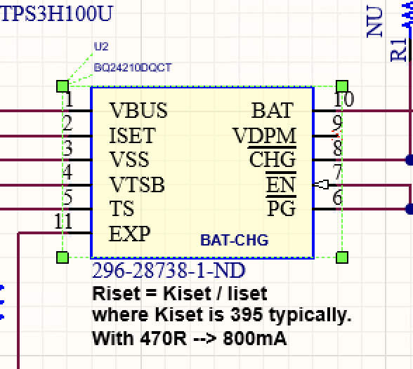
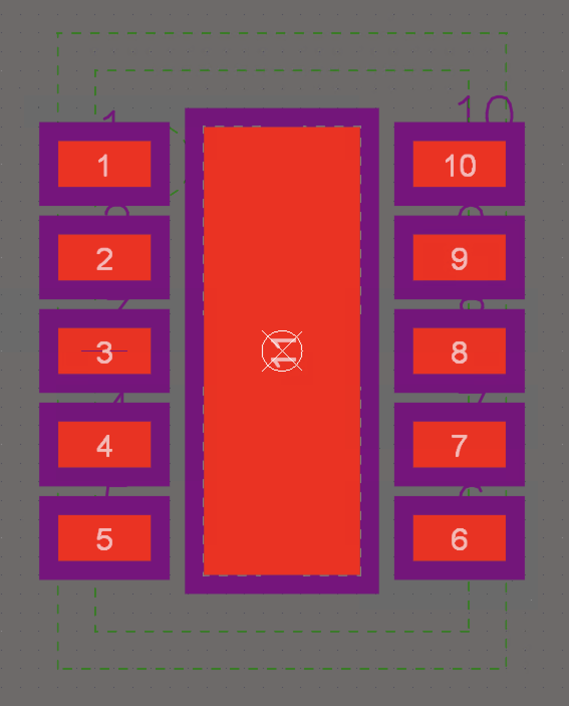
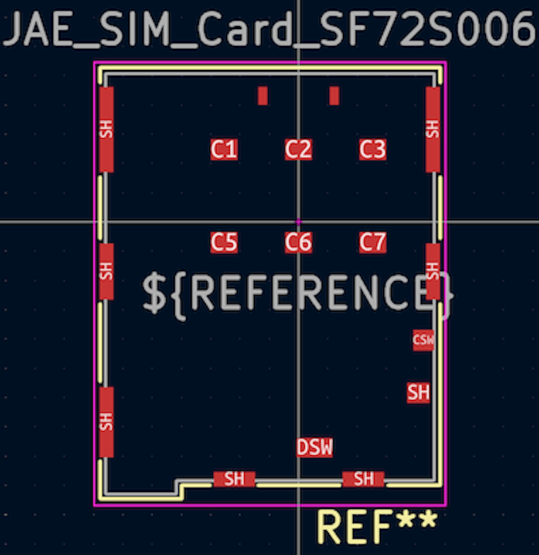

# Porting Notes - Notecarrier-F

As per [Notecarrier-B](../../../Notecarrier-B/KiCad_format/documentation/PortingNotes.md), except:

## Schematic

- This is an Altium port, not an OrCAD port.
- The input/output power net distinction does not apply, so I'm switching to the KiCad arrow convention instead of the Altium circle convention, and using KiCad symbols where they exist, since the interpretation is clear.
	- That said, the `VBAT` symbol is already an arrow. I can find no explanation for the distinction, so am ignoring it.
	- Same goes for `F_BAT` and `N_VIO`, which is (sometimes) a bar!
	- Sadly this is also true of the chassis/earth symbols that are labelled `GND`. They are a distinction without apparent meaning, so I've opted to replace them with arrow `GND` symbols.
- Once again, I'm ensuring symbols and footprints adhere to the existing design, rather than imposing KiCad or other industry standards. This means doing the hard work up front of replicating the source design, rather than simply substituting existing library components. Therefore, design risk is minimised as a first priority, but an easy path is left open to apply more standard conventions down the track.
- There's little advice on signal flow: inputs and outputs are scattered a bit haphazardly and functional blocks are overlapping and unlabelled. So at times I've had to be a bit inventive to group and label things into functional boxes. I've erred on the side of retaining as much parity with the original as possible, as to not inadvertently introduce confusion, but still add some neat blue boxes and illuminating labels wherever possible.
	- Together with the top level sheet I've introduced, this should result in a significantly easier to understand schematic, that is nonetheless a clear reproduction of the original.
	- However it wasn't always possible to have hierachial labels on the outside of the boxes without substantial re-routing. In these cases I've compromised and left the hierarchial labels inside the functional blocks.
- Some options for porting the original Off-Sheet Connectors were considered. To recap, Altium has three net name scopes: Net Labels (default to local to sheet), Off Sheet Connectors (global to schematic), and Ports (can be shared amongst sheets using hierarchal connections). The source files used Net Labels and Off Sheet Connectors exclusively, and no hierarchy. A like-for-like port would have used KiCad Labels for the Net Labels, and Global Labels for the Off Sheet Connectors. However, to leverage KiCad's ERC during the port, and create a KiCad project that is both maintainable and verifiably equivalent to the original, the decision was made to port all the Off Sheet Connectors as Hierarchial Labels, so a hierarchy could be introduced.
	- To return to a like-for-like port, the top-level sheet can simply be deleted and all Hierarchial Labels replaced with Global Labels with the same name. The reverse operation cannot be done automatically, since it requires the creation of the top-level sheet. Thus, this port represents a strictly better alternative, since the like-for-like port can be automatically derived from it.
	- Ultimately, this process was not sufficient to port the design. It turns out several of the Net Labels actually need to be global, and this was achieved in Altium by setting the "Net Identifier Scope" setting to "Automatic". Since there is no hierarchy in the original design, this automatic setting makes *all* labels global.
		- KiCad does not have an equivalent setting, and using Global Labels in place of the Labels not only sacrifices the advantages of the hierarchy, it also produces an unattractive result due to the different visual geometry of a Global Label. Thus, an extra "Label Promotion" section was added to sheets where necessary, to promote to Hierarchial Labels those Labels that require inter-sheet connectivity.
		- This means the port remains true to the original, with additional data to indicate the global nature of some of the labels.
		- Even if the hierarchy was scrapped, the promotion would be necessary. The only difference would be the Labels would be promoted to Global Labels instead of Hierarchial Labels.
		- There is one instance where things are the other way around: `F_NRST` is a Off Sheet Connector in the original, but is not used off sheet. I have left it as is, and it produces the only error in the ERC for posterity.
- A minor one, but came up a lot: in KiCad net labels are anchored at either the start or end of the text, and nets themselves indicate they have not been terminated (eg. with a net label) with a little empty box. This prompts quality control conventions like using net labels to terminate the right or left of nets, rather than adding them at arbitrary locations along the net. That means labels on nets that terminate to the right will be aligned on their right side, with a staggered left side according to the length of the label. I have opted to adopt this KiCad convention, since it is cosmetic only, and prevents the non-conventional and doubt-inducing empty boxes.
- KiCad symbols must be annotated (ie. the reference designator starts with a letter and ends with a number) for various functions to work like ERC and synchronising the schematic with the PCB. Thus for ease of use I've renamed `MOD1L` to `MODL1` and `MOD1R` to `MODR1`, since I can't see any possibility for harm.


## PCB

- This is an Altium port, not an OrCAD port.
	- Significantly, this means that using KiCad's import into `pcbnew` feature is very effective. There is still too much lost in translation to use as a starting point, however this is still a simpler and more accurate way to create the pcb polygons than the gerber-to-kicad-via-DXF method used for the OrCad Notecarrier-B project.
	  - This technique was used to create the entire Edge.Cuts, User.Comments (dimensions) and copper layers by copying, pasting and positioning.
		  - The dimensions layer then just needed work to correct fonts and labels positions.
		  - The copper layers mostly only needed pour settings corrected.
		  - Other layers like silkscreens and manufacturing instructions are dominated by elements like text fields that don't port well, so they were created manually.
		  - Non-layer elements like drills and components were done in a similar manner to the OrCAD port: create/generate native equivalents and then position/configure them with the help of scripts.
- I'm a bit confused by `U2`, the `BQ24210DQCT` with the `WSON10-EXP` footprint. Not only does it have strange fonts in its labels on the schematic, Italian field names and a visible order number, the footprint has no silkscreen, solid regions with "Kind" unspecificed (that appear as dashed lines), paste orifices that are filled in by other paste polygons, only 0.05mm between solder mask openings, no Mechanical 13 layer elements (typically used for body outline), no Mechanical 15 layer elements (typically used for courtyard and origin cross-hair), and has pin numbers on Mechanical 26! The footprint appears the same in the PCB, yet in the assembly drawing on page 7 of `n21-evt_2022-05-20_assembly.PDF` the part has an effective outline and label.
  - I'm going to assume this is a one-off poor quality import from a FEA OrCAD project, replicate the critical elements from the manufacturing layers (silkscreen, copper, paste, etc), but create sensible BOM metadata and fabrication/assembly layers. In particular, for the symbol I'm going to translate the BOM fields to those used by other parts. And for the footprint I'm going to ignore Mechanical 26, and create courtyard and body outline (fab) layers.

| U2 Symbol | U2 Footprint |
| --------- | ------------ |
|  |  |


- Altium can't natively generate a drill report like OrCAD. Two options are to parse the NC Drill file, or extract the drill coordinates from the imported PCB file. I've opted to do the latter for expediency. Something like (after setting the selection filter to vias and selecting all):

```
for t in pcb.GetTracks():
    if t.IsSelected():
        print(f"{t.GetWidth()};{t.GetDrill()};{t.GetPosition()}")
```


## Library

- Many footprints overlap with those already ported from Notecarrier-B.
	- One of two strategies was applied:
		1. Where substantial differences exist and the existing is not a worthy substitute, the footprint name tends to also be different, so the new footprint has been retained and lives alongside the existing in the shared library.
			- In one case the names were the same so an alternate name was picked: `9774025151R` instead of `DIST-WASMSIM0250`.
		1. Occasionally, where differences are not substantial, or the existing is a superset of the new (eg. same copper but additional silkscreen/fab graphics), the existing has been substituted.
			- Eg, `TO277-3` or `FS-0603` or `BQ24210DQCT` vs `WSON10-EXP`.
			- This did mean having to rotate each of the `TO277-3` parts 180° on the PCB.
	- This way, nothing is lost but we also don't end up with insignificant duplicates in the library.
	- Still, there remains multiple footprints for the same part (eg. `PTS810-SJS-250-SMTR-LFS` and `C&K PTS810`, or `CJS-1200TA` and `SW_CJS-1200TA`, or even the passives like `RS-0402` and `RES 0402_1005`) so to further differentiate them the "Description" field for the new footprints indicates they're from Notecarrier-F. This is intended to help filter them out in the future, so new designs can go forward with a single footprint convention.
	- There are two special cases:
		- The Nano SIM footprint in the KiCad library has pin names that match the KiCad symbol. The KiCad symbol was used in place of the original symbol as per the porting conventions, but this means the pin names don't match up with the ported footprint. Since the ported footprint is significantly different to the KiCad default, the ported footprint has been modified just to match up the pin names.
		- The `SMB` footprint in the KiCad library and the `SMB` footprint from the Notecarrier-B project follow the common convention of indicating the cathode on pin 1. The `SMB` footprint from the Notecarrier-F project indicates the cathode is on pin 2, yet the pin assignment is the same! In other words, the silkscreen is backwards. To avoid introducing confusion, I've kept the original design as is, but renamed the footprint `SMB_Backwards`.

| Altium NanoSIM Footprint | KiCad NanoSIM Footprint |
| --------- | ------------ |
|  |  |

- The source PCB used the "Barlow (Semibold)" font heavily, such as in the silkscreen. I've been able to obtain a copy from Google Fonts and create equivalent text artefacts. However it is not appropriate for me to distribute the font with the design, so users will need to obtain and install the font themselves.
	- On the other hand, I was [not able](https://www.eevblog.com/forum/kicad/vector-fonts/msg4836302/#msg4836302) to obtain a copy of the Altium "Default" font, which tended to be used for things like dimension labels. I tried a few alternatives and found KiCad's native font was the closest. Since the usage of the font does not affect the PCB itself, I'm satisfied with the substitution.
	- Same story for the manufacturing instructions and fabrication notes. The source file tends to use Altium's "Sans Serif" font. I've substitued KiCad's native font.


## Validation


**TODO:**

- During import of footprints:
	- Altium layer 72 moved to Eco1_User
	- Altium layer 71 moved to Eco1_User
	- OBJ1 pad 1 complex pad stack not supported.
	- Ignored polygon shape of kind 2.
